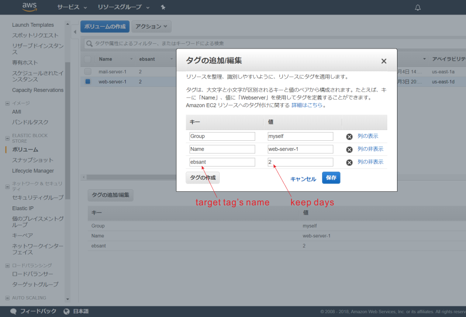

# ebsant

Take snapshot of AWS EC2's volume

> **Deprecated**  
> 03/03/2019: You use AWS managed service [Amazon Data Lifecycle Manager](https://docs.aws.amazon.com/AWSEC2/latest/UserGuide/snapshot-lifecycle.html) to handle backup of your EC2's volumes instead.

## Requirements

* Python 2.7 or higher
* Boto3 library

## Setup steps:

### 1. Set target volumes in AWS console

The script will take snapshot of volumes which have specific tag (default is `ebsant`).

The value of this tag is the integer declares the number of days to keep old snapshots in. If negative number is set, old snapshots will be kept permanently.

### 2. Set write permission of log directory

Don't forget to set write permission of log directory (`./logs`) to the user who executes the script.

~~~
$ chmod 777 /{path_to_source}/logs
~~~

### 3. Execute

~~~
python /{path_to_source}/main.py {option} {value}
~~~

Command options:

|Option|Required|Default value|Description|
|---|---|---|---|
|`-r`, `--region`|Yes|-|AWS region code|
|`-i`, `--id`|Yes|-|IAM user's AWS_ACCESS_KEY_ID|
|`-k`, `--key`|Yes|-|IAM user's AWS_SECRET_ACCESS_KEY|
|`-t`, `--target-tag`|No|'ebsant'|Target tag's name|
|`-l`, `--log`|No|'/{path_to_source}/logs/log.txt'|Path to log file|
|`-h`, `--help`|No|-|Show help|
|`-v`|No|-|Show credit info|
